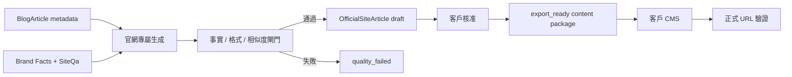

# 官網第一方專屬內容架構

## 目標

Geovault 平台文章與客戶官方網站文章必須是兩條不同的內容生命週期：

- `BlogArticle`：Geovault 平台公開內容，用於平台自身的 AI 引用與內容交付。
- `OfficialSiteArticle`：客戶第一方官網內容，只能使用客戶已確認的 Brand Facts 與知識庫資料生成。

每週 `client_daily` 只寫入 `BlogArticle`，不讀取或寫入 `OfficialSiteArticle`。

## 使用者流程

1. 客戶在 `/sites/:siteId/official-content` 輸入主題、官網 canonical URL 與可選的平台主題靈感。
2. API 只取平台來源的標題、摘要與關鍵字 metadata，不把平台正文送進 prompt。
3. `BrandFactService` 建立第一方資料快照，資料不足時拒絕生成。
4. AI 重新生成官網文章，通過事實規則、格式規則與三字元相似度閘門後保存為 `draft`。
5. 客戶審核後狀態變成 `export_ready`，才可取得 Markdown、CMS HTML、Meta 與 JSON-LD。
6. 客戶貼到自己的 CMS 後輸入正式 URL，驗證器檢查 HTML、canonical、Article JSON-LD、FAQ、OG 與 noindex。

## 邊界與契約

| 邊界 | 規則 |
| --- | --- |
| 平台來源 | 只能傳 metadata；不得傳 `BlogArticle.content` |
| 第一方資料 | 由 `BrandFactService` 與 `SiteQa` 提供；不完整時停止生成 |
| 相似度 | 以 `maxSimilarity` 比對平台與同站官網文章；達門檻即 `quality_failed` |
| 發布 | 不自動寫入客戶後端；只提供客戶 CMS 可貼上的內容包 |
| 驗證 | 只讀取客戶正式 URL，結果保存於 `verificationReport`，不偽造 GEO 分數 |

## 資料模型

`OfficialSiteArticle` 以獨立資料表保存草稿、品質結果、結構化資料、核准時間、內容包輸出時間與上線驗證結果。`sourceArticleId` 僅為主題溯源，不代表內容複製關係。

## 流程圖

## 不受影響的流程

`client_daily` 的排程、生成、品質修復、平台公開與既有 `BlogArticle` 查詢不依賴 `OfficialSiteArticle`，因此官網專屬內容功能失敗時不會阻塞每週平台文章交付。
