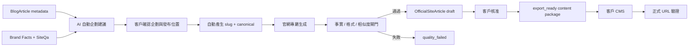

# 官網第一方專屬內容架構

## 目標

Geovault 平台文章與客戶官方網站文章必須是兩條不同的內容生命週期：

- `BlogArticle`：Geovault 平台公開內容，用於平台自身的 AI 引用與內容交付。
- `OfficialSiteArticle`：客戶第一方官網內容，只能使用客戶已確認的 Brand Facts 與知識庫資料生成。

每週 `client_daily` 只寫入 `BlogArticle`，不讀取或寫入 `OfficialSiteArticle`。

## 使用者流程

1. 客戶開啟 `/sites/:siteId/official-content`，`recommendation` API 先讀取 Brand Facts、FAQ、近期平台主題 metadata 與既有官網文章。
2. 系統自動帶入文章主題、內容角度、官網 CMS 發布位置與建議 SLUG；客戶只需確認或微調，不必自行發想。
3. API 只取平台來源的標題、摘要與關鍵字 metadata，不把平台正文送進 prompt。
4. `BrandFactService` 建立第一方資料快照，資料不足時拒絕生成並指出缺少欄位。
5. AI 以「可被收錄、引用、推薦與摘要」為目標重新生成官網文章，通過第一方事實、AI 可擷取結構、FAQ、可執行答案、相似度與 GEO 品質分數閘門後保存為 `draft`。
6. 未通過時，系統帶著具體失敗原因自動重寫，最多 3 次；3 次仍不合格就保存為 `quality_failed`，禁止核准並建議換主題。
7. 系統由 `publishBaseUrl + slug` 自動組出 canonical URL；slug 使用純 ASCII 語意詞，撞名時改用另一個語意版本，不加序號或代碼；舊版傳入完整 canonical URL 的客戶仍可相容。
8. 客戶可輸入自訂主題方向；若不輸入，系統會依 Brand Facts、FAQ、最新網站掃描指標與 AI 引用綜合報告判斷。
9. 客戶審核後狀態變成 `export_ready`，才可取得 Markdown、CMS HTML、Meta 與 JSON-LD。
10. 客戶貼到自己的 CMS 後輸入正式 URL，驗證器檢查 HTML、canonical、Article JSON-LD、FAQ、OG 與 noindex。

## 邊界與契約

| 邊界 | 規則 |
| --- | --- |
| 平台來源 | 只能傳 metadata；不得傳 `BlogArticle.content` |
| 第一方資料 | 由 `BrandFactService` 與 `SiteQa` 提供；不完整時停止生成 |
| 相似度 | 以 `maxSimilarity` 比對平台與同站官網文章；達門檻即 `quality_failed` |
| 發布 | 不自動寫入客戶後端；只提供客戶 CMS 可貼上的內容包 |
| 企劃 | `GET /sites/:siteId/official-articles/recommendation` 不扣 AI 額度；生成請求可省略 topic、angle、slug 與完整 URL |
| 主題 | `topicDirection` 可由客戶提供方向；未提供時由第一方資料、掃描與引用報告決定，不憑空猜測 |
| 品質 | 每次生成最多 3 次自動優化；品質門檻未通過就保留 `quality_failed`，不可輸出給客戶 |
| 網址 | `publishBaseUrl` 儲存客戶 CMS 集合位置，例如 `https://brand.com/blog`；canonical 由系統自動組合，slug 使用可讀的 ASCII 英數字，碰撞時改用語意替代詞 |
| 驗證 | 只讀取客戶正式 URL，結果保存於 `verificationReport`，不偽造 GEO 分數 |

## 資料模型

`OfficialSiteArticle` 以獨立資料表保存草稿、品質結果、結構化資料、核准時間、內容包輸出時間與上線驗證結果。`publishBaseUrl` 保存已確認的 CMS 集合位置，`canonicalUrl` 保存該篇文章的最終網址，`sourceArticleId` 僅為主題溯源，不代表內容複製關係。

## 流程圖

## 不受影響的流程

`client_daily` 的排程、生成、品質修復、平台公開與既有 `BlogArticle` 查詢不依賴 `OfficialSiteArticle`，因此官網專屬內容功能失敗時不會阻塞每週平台文章交付。
